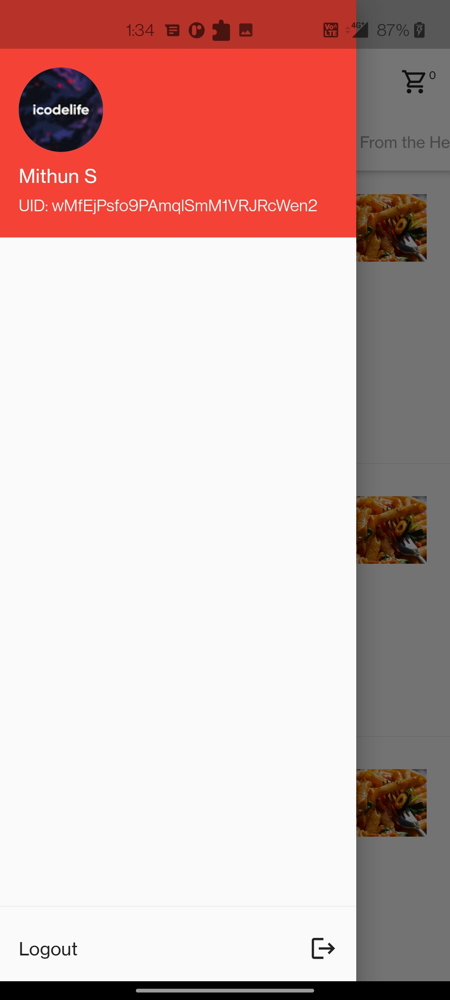

# Flutter Firebase / REST API Demo

### Download APK
[app-release.apk](https://github.com/icodelifee/firebase-auth-app/blob/main/apk/app-release.apk)

## Screenshots
<table>
  <tr>
    <td> </td>
    <td> </td>
    <td> </td>
    <td> </td>
    <td> </td>
    <td> </td>
   </tr> 

  </tr>
</table>

## Build Setup
``` bash

# install dependencies
$ flutter pub get

# run debug mode
$ flutter run

# run release mode
$ flutter run --release

# build app bundle
$ flutter build appbundle

# build apk
$ flutter build apk

```

  

For detailed explanation on how things work, check out [Flutter docs](https://flutter.dev/docs).
